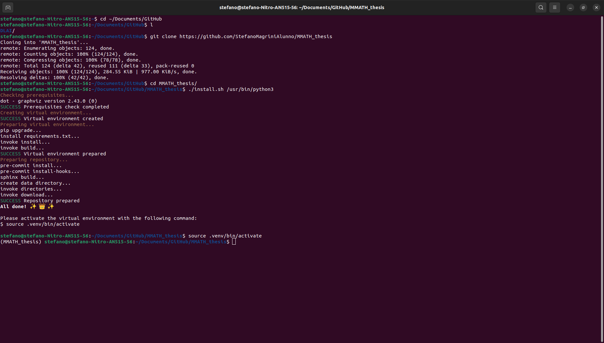

# MMATH Thesis Project

Autori e finalità della repository...

## Prerequisites
- `Linux Ubuntu` 22.04
- `Python` 3.10.12 with:
  - `pip` 24.2
  - `virtualenv` 20.26.3
  - `python3-dev` 3.10.6-1~22.04
  - `python3-dbg` 3.10.12
- `GCC` 11.4.0 with:
  - `doxygen` 1.9.1
  - `graphviz`
- `CUDA 12.5` with `nvcc` 12.5 (required NVIDIA drivers)

## Download and Install the repository
```bash
# Download repository
cd /path/where/download/repository
git clone https://github.com/StefanoMagriniAlunno/MMATH_thesis
cd MMATH_thesis
# Install repository
./install.sh /path/of/python/executable
```



# Use the repository

## Contents
### Documentation
This repository uses:
- `Sphinx` to create documentation for Python scripts.
- `Doxygen` to create documentation for C/C++, Fortran and Java programs.

Open complete documentation in `docs/_build/html/index.html` with your browser.
### Base packages for repository
```bash
pip3 install invoke pre-commit pytest jupyter sphinx esbonio breathe
pip3 install flake8 doc8 mypy black autoflake isort shellcheck-py
pip3 freeze > requirements.txt
```
### How to add own packages and contents
Open **tasks.py**:
- `install` task adds packages
- `download` task adds dataset, models and other media.

When you add a project, insert the path of the project in the Doxyfile in the `INPUTS` key:
```bash
INPUT                  = source/projects/your_project/main.c \
                         source/projects/your_project/inc \
                         source/projects/your_project/src
```

## Pre-commit

This repository use pre-commit:
- pre-commit-hooks
  - trailing-whitespace
  - end-of-file-fixer
  - mixed-line-ending
  - check-yaml
  - check-json
  - check-docstring-first
  - sort-simple-yaml
  - pretty-format-json --autofix
- flake8 --ignore=E203,E501,W503
- doc8 --ignore=D001
- autoflake
- isort
- mypy
- shellcheck
- black

# Issue

**Don't have a git command on your device? No problem...**
```bash
sudo apt install git-all
```

## How to install virtualenv
```bash
sudo apt install python3-pip
sudo apt install python3-dev
pip install --upgrade pip==24.1.2
pip install virtualenv
```
## How to install GCC
```bash
sudo apt install build-essential
sudo apt install cmake
sudo apt install doxygen graphviz
```
## How to install CUDA
Open Additional Drivers in Software&Updates and select the recommended nvidia driver.
Restart your device and install the cuda toolkit:
```bash
sudo apt install nvidia-cuda-toolkit
sudo apt install nvtop
```
It's possible that the software use cudnn's packages, in this case:
```bash
wget https://developer.download.nvidia.com/compute/cuda/repos/ubuntu2204/x86_64/cuda-keyring_1.1-1_all.deb
sudo dpkg -i cuda-keyring_1.1-1_all.deb
sudo apt update
sudo apt install cudnn
sudo apt install cudnn-cuda-12
```
